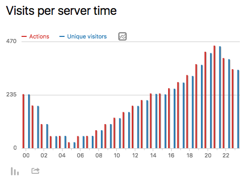
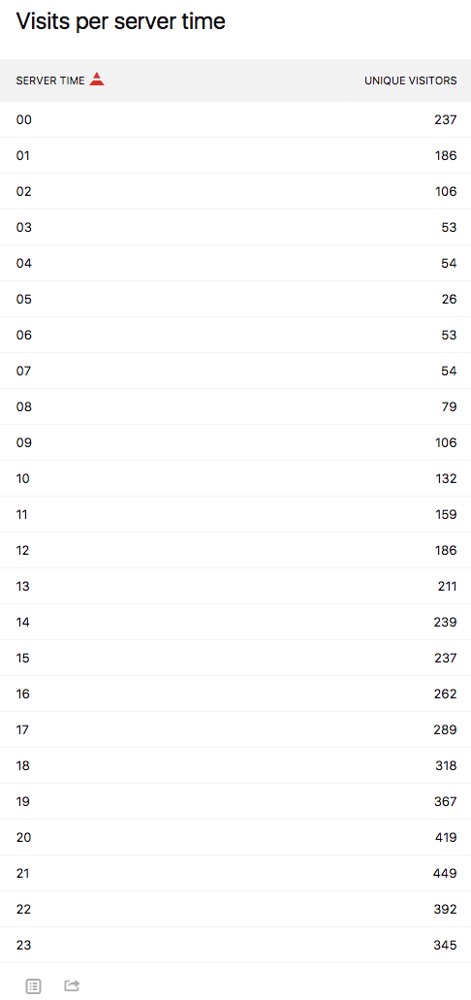
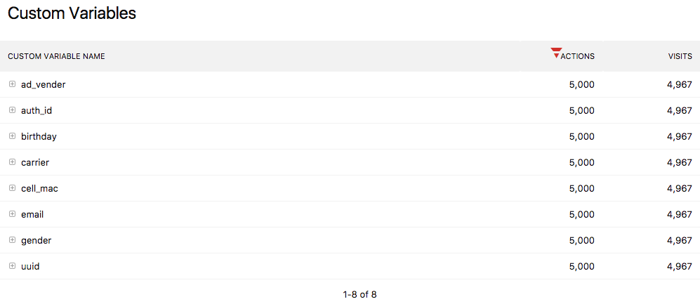
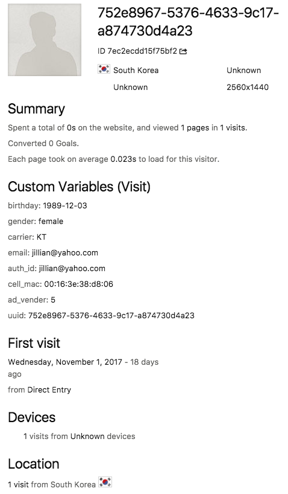

## Sampler

### 목적

Dummy data를 만들어 Http request를 통해 workload를 발생시킵니다.

### Dependencies

pyyaml, termcolor, aiohttp, names

```
  $ pip3 install pyyaml
  $ pip3 install termcolor
  $ pip3 install aiohttp
  $ pip3 install names
```

### 사용방법

```
$ python3.6 main.py -h
usage: main.py [-h] [-c YAML_PATH]

Web request generator using dummy data

optional arguments:
  -h, --help            show this help message and exit
  -c YAML_PATH, --conf YAML_PATH
                        use custom yaml config (default: conf/dev.yaml)
```

Default yaml config를 이용하는 예,

```
$ python3.6 main.py
[[2017/11/20 06:19:24]] validate(...) 0.00 sec
[[2017/11/20 06:19:24]] parse(...) 0.00 sec
[[2017/11/20 06:22:56]] run(...) 212.28 sec
```

Local web server를 이용하여 테스팅을 하는 예,

```
$ python3.6 tests/server.py &
$ python3.6 main.py -c conf/local.yaml
```

설정은 conf디렉토리에 있는 .yaml을 이용합니다. dev.yaml은 개발서버를 위한 버전입니다. 다른 custom yaml을 만들어 추가하셔도 됩니다.

```
# The hostname and port are used to create
# the url of the target web server
hostname: was01
port: 8290

# This is the start and end date of the workload
start_date: 2017-11-11
end_date: 2017-11-11

# The timezone consists of time zone name
# (e.g. UTC, EST, CST, GMT)
# and UTC offset in the form +HHMM or --HHMM
# (e.g., Asia/Seoul => GMT+0900)
timezone: GMT+0900

# The total number of http requests. The workload
# is divided into days between start an end.
num_requests: 10000

# The number of user instances created in the user pool
num_users: 50000

# Piwik's site number
# (c.f., https://plugins.piwik.org/SiteURLtrackingID)
idsite: 1

# (e.g., http://piwik/tracker?...)
controller: tracker

# Piwik's token auth is used to athenticate in API requests
# (c.f., https://piwik.org/faq/general/faq_114/)
token_auth: 6d016aec55497ecaa61b7dd83fa209aa

# Distribution of workload over time
#
# The way to obtain each hourly portion is calculated by
# dividing the total divided by the total number of
# allocated http requests.
# For more details,
# * All hours up to 0-23 must be present
# * If you want to mean 0%, you only need to specify (e.g., 11: ,)
# * Characters are meaningless and use only length. Hence,
#   you can use any of the available characters
traffic_distribution:
  {
    0:  +++++++++,
    1:  +++++++,
    2:  ++++,
    3:  ++,
    4:  ++,
    5:  +,
    6:  ++,
    7:  ++,
    8:  +++,
    9:  ++++,
    10: +++++,
    11: ++++++,
    12: +++++++,
    13: ++++++++,
    14: +++++++++,
    15: +++++++++,
    16: ++++++++++,
    17: +++++++++++,
    18: ++++++++++++,
    19: ++++++++++++++,
    20: ++++++++++++++++,
    21: +++++++++++++++++,
    22: +++++++++++++++,
    23: +++++++++++++,
  }
```

### 테스트

다음과 같은 형태의 URL을 생성합니다.

```
http://piwik/piwik.php?action_name=&idsite=1&rec=1&r=100224&h=14&m=26&s=7&url=http://localhost:8080&uid=f2ed9618-a0a0-4ce8-844c-f66435a599ee&_id=943d87d1f567f0b0&token_auth=aa4559b9f29b1351124f58255c303bfa&cdt=1509889669&_idts=1510549337&_idvc=1&_idn=0&_refts=0&_viewts=1510549337&send_image=1&pdf=1&qt=0&realp=0&wma=0&dir=0&fla=0&java=0&gears=0&ag=0&cookie=1&res=2560x1440&_cvar={"1": ["birthday", "1957-03-23"], "2": ["gender", "female"], "3": ["carrier", "LGT"], "4": ["email", "linda@yahoo.com"], "5": ["auth_id", "linda@yahoo.com"], "6": ["cell_mac", "00:16:3e:13:33:1d"], "7": ["ad_vender", 8], "8": ["uuid", "f2ed9618-a0a0-4ce8-844c-f66435a599ee"]}&gt_ms=23&pv_id=OulOts
```

다음과 같은 형태의 방문 행태를 timeline view/table를 통해 확인 할 수 있습니다.
#### * Timeline view


#### * Table view



접속한 방문자의 정보는 Custom variable 항목에 담겨서 전달이 됩니다.



접속자의 정보를 좀 더 들여다 보면 user id로 UUID를 가지며, 그 외에 custom variable, action 또는 custom event등을 전달 받을 수 있습니다.
아래의 경우는 custom variable의 sample을 확인 할 수 있습니다.

